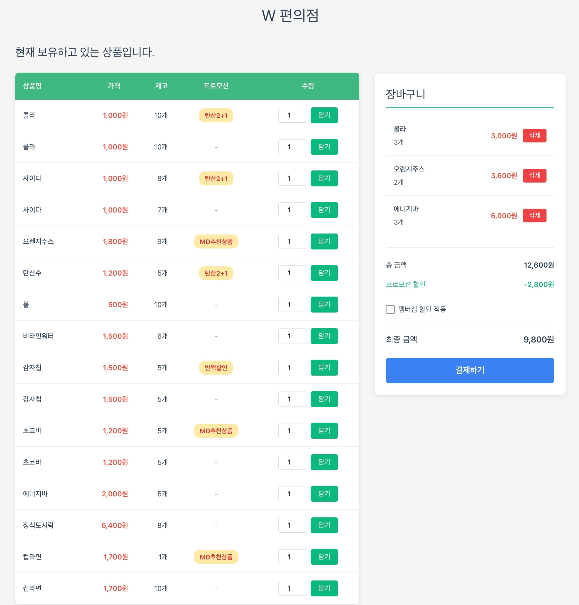
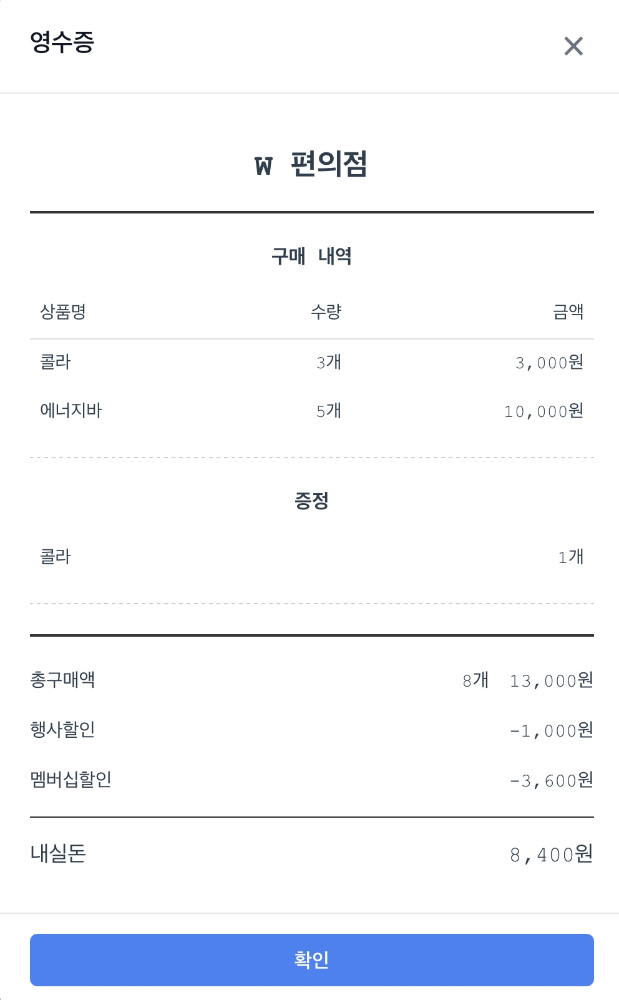
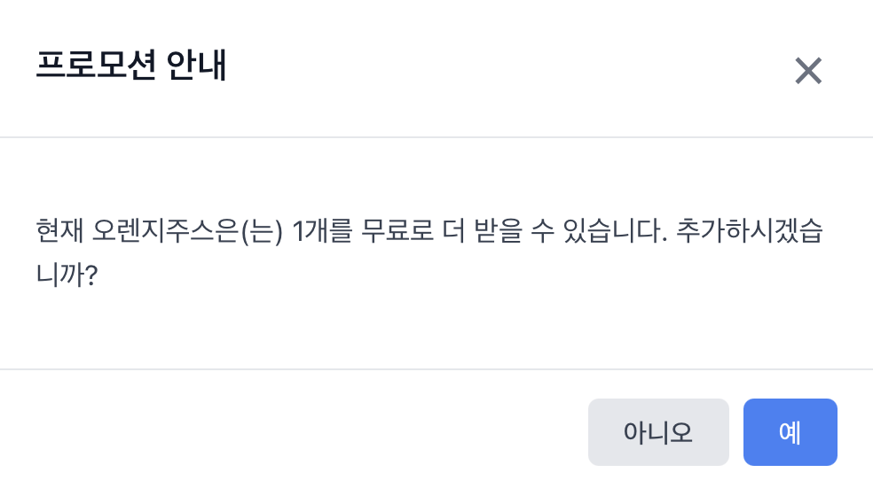

# 편의점 POS 시스템

> 우아한테크코스 8기 프리코스 오픈미션

> 프로젝트 개발 과정과 문제 해결 및 학습 내용은 [devlog](./devlog) 폴더에서 확인할 수 있다.

## Table of Contents

1. [프로젝트 소개](#프로젝트-소개)
2. [기술 스택 및 선정 이유](#기술-스택-및-선정-이유)
3. [프로젝트 구조](#프로젝트-구조)
4. [주요 기능](#주요-기능)
5. [기능 예시 (원본 미션 기준)](#기능-예시-원본-미션-기준)
6. [시작하기](#시작하기)

## 프로젝트 소개

[우테코 7기 편의점 미션](https://github.com/woowacourse-precourse/javascript-convenience-store-7)을 Vue.js와 TypeScript로 재구현한 프로젝트이다.

기존 Console 기반 미션을 웹 UI 환경으로 재해석하여, 재고 관리, 프로모션 계산, 영수증 출력 등의 핵심 비즈니스 로직을 모던 프론트엔드 기술 스택으로 구현한다. 콘솔 입출력은 브라우저 화면의 입력 폼과 UI 컴포넌트로 대체되며, 사용자 경험을 향상시킨 편의점 POS 시스템을 목표로 한다.

이 프로젝트는 객체지향 설계 원칙을 최대한 따르는 것을 목표로 한다. 상품(Product), 프로모션(Promotion), 재고(Inventory), 영수증(Receipt) 등 도메인 개념을 명확한 클래스로 분리하고, 각 클래스가 단일 책임을 가지도록 설계한다. TypeScript의 타입 시스템과 인터페이스를 활용해 객체 간 협력 관계를 명확히 정의하며, 캡슐화와 추상화를 통해 유지보수 가능한 코드를 작성한다.

## 기술 스택 및 선정 이유

### Vue 3 (Composition API)

1. 컴포넌트 재사용성: Composition API를 통해 로직을 함수 단위로 분리하고 재사용할 수 있어, 상품 카드, 장바구니, 영수증 등 반복되는 UI 로직을 효율적으로 관리
2. 반응형 시스템: 명시적인 반응형 데이터 관리로, 재고 변경이나 프로모션 적용 같은 실시간 업데이트가 필요한 로직 구현에 적합
3. Template 문법: JSX가 아닌 HTML 기반 템플릿 문법으로 디자이너와의 협업이나 마크업 작업이 직관적
4. 학습 곡선: React보다 개념이 단순하고 공식 문서가 체계적이어서, 2주 내 프로젝트 완성에 유리하다고 판단

### TypeScript

1. 새로운 도전: JavaScript만 사용해본 상태에서 타입 시스템을 학습하고 적용해보는 첫 경험. 우테코 프리코스를 통해 처음 접한 여러 코딩 경험을 타입 안전성이라는 새로운 개념으로 확장하는 기회
2. 타입 안전성: 상품, 프로모션, 재고 등 복잡한 도메인 객체의 구조를 인터페이스로 명확히 정의하여 런타임 에러 방지
3. IDE 지원: 자동완성과 타입 추론으로 개발 속도 향상 및 오타로 인한 버그 감소
4. 리팩토링 안정성: 클래스나 인터페이스 변경 시 영향받는 모든 코드를 컴파일 타임에 파악 가능
5. 객체지향 구현: class, interface, abstract 등 OOP 개념을 언어 레벨에서 지원하여 도메인 모델 설계에 유리

### Vite & Pinia & Vitest

Vue 3 프로젝트 생성 시 함께 선택한 공식 생태계 도구들이다.

1. Vite: ESM 기반 빠른 개발 서버(1초 이내 구동)와 HMR로 즉각적인 피드백 제공
2. Pinia: Vue 3 공식 상태 관리 라이브러리. TypeScript 타입 추론이 완벽하게 지원되며, 장바구니와 재고 같은 전역 상태를 간결하게 관리
3. Vitest: Vite 기반 테스트 도구로 별도 설정 없이 빠른 테스트 실행 가능. Jest API와 호환되어 학습 부담이 적음

## 프로젝트 구조

```
woowa-open-mission-vue-ts/
├── src/
│   ├── __tests__/                            # 테스트 파일
│   │   ├── Product.test.ts
│   │   ├── Promotion.test.ts
│   │   ├── Cart.test.ts
│   │   ├── Inventory.test.ts
│   │   └── PromotionPolicy.test.ts
│   ├── assets/                               # 스타일시트
│   │   └── main.css
│   ├── components/                           # Vue 컴포넌트
│   │   ├── BaseModal.vue                     # 기본 모달
│   │   ├── CartSummary.vue                   # 장바구니 요약
│   │   ├── ProductList.vue                   # 상품 목록
│   │   ├── ProductTableRow.vue               # 상품 테이블 행
│   │   ├── PromotionBadge.vue                # 프로모션 배지
│   │   ├── PromotionConfirmModal.vue         # 프로모션 확인 모달
│   │   └── ReceiptModal.vue                  # 영수증 모달
│   ├── constants/                            # 상수 정의
│   │   ├── constants.ts                      # 비즈니스 상수
│   │   ├── errorMessages.ts                  # 에러 메시지
│   │   └── uiMessages.ts                     # UI 메시지
│   ├── domain/                               # 도메인 클래스 (비즈니스 로직)
│   │   ├── Product.ts                        # 상품
│   │   ├── Promotion.ts                      # 프로모션
│   │   ├── CartItem.ts                       # 장바구니 항목
│   │   ├── Cart.ts                           # 장바구니
│   │   ├── Inventory.ts                      # 재고 관리
│   │   └── PromotionPolicy.ts                # 프로모션 정책
│   ├── stores/                               # Pinia 상태 관리
│   │   └── cartStore.ts                      # 장바구니 스토어
│   ├── utils/                                # 유틸리티
│   │   ├── csvParser.ts                      # CSV 파서
│   │   ├── productParser.ts                  # 상품 파서
│   │   └── promotionParser.ts                # 프로모션 파서
│   ├── App.vue                               # 루트 컴포넌트
│   └── main.ts                               # 진입점
├── public/
│   └── data/                                 # 데이터 파일
│       ├── products.md                       # 상품 데이터 (CSV)
│       └── promotions.md                     # 프로모션 데이터 (CSV)
└── devlog/                                   # 개발 기록
```

## 주요 기능

### 1. 상품 관리

- 상품 목록 조회 및 표시
  - 상품명, 가격, 재고 수량 표시
  - 프로모션 정보 표시
  - 재고 없음 상태 표시
- 프로모션 재고와 일반 재고 구분 관리

### 2. 프로모션 시스템

- N+1 무료 증정 방식
  - 2+1: 2개 구매 시 1개 무료 (콜라, 사이다 등)
  - 1+1: 1개 구매 시 1개 무료 (오렌지주스, 초코바 등)
- 프로모션 기간 자동 확인
  - 현재 날짜 기준 유효한 프로모션만 적용
- 지능형 프로모션 안내
  - 추가 증정 가능 시 알림 (예: "현재 콜라는 1개를 무료로 더 받을 수 있습니다")
  - 정가 결제 필요 시 확인 요청 (예: "현재 콜라 4개는 프로모션 할인이 적용되지 않습니다")

### 3. 구매 및 결제

- 다중 상품 구매 지원
  - 입력 형식: `[상품명-수량]` (예: `[콜라-3],[사이다-2]`)
- 멤버십 할인
  - 프로모션 미적용 금액의 30% 할인
  - 최대 할인 한도: 8,000원
- 실시간 금액 계산
  - 총구매액 자동 계산
  - 행사할인 적용
  - 멤버십할인 적용
  - 최종 결제 금액 산출

### 4. 영수증 출력

- 구매 상품 내역 (상품명, 수량, 금액)
- 증정 상품 목록
- 할인 내역 상세 표시
- 최종 결제 금액

### 5. 재고 관리

- 실시간 재고 차감
  - 구매 즉시 재고 업데이트
- 프로모션 재고 우선 사용
  - 프로모션 재고 먼저 차감
  - 부족 시 일반 재고 사용
- 재고 부족 안내
  - 재고 초과 구매 시도 시 에러 메시지 표시

### 6. 추가 기능

- 추가 구매 지원 (영수증 출력 후 재구매 가능)
- 입력 유효성 검증 및 에러 처리
- 존재하지 않는 상품 구매 방지

## 기능 예시 (원본 미션 기준)

> 아래는 웹 UI 환경으로 재해석한 이미지와, Console 기반 원본 미션의 실행 예시이다.

### 1. 상품 목록 표시



```
안녕하세요. W편의점입니다.
현재 보유하고 있는 상품입니다.

- 콜라 1,000원 10개 탄산2+1
- 콜라 1,000원 10개
- 사이다 1,000원 8개 탄산2+1
- 사이다 1,000원 7개
- 오렌지주스 1,800원 9개 MD추천상품
- 오렌지주스 1,800원 재고 없음
- 탄산수 1,200원 5개 탄산2+1
- 탄산수 1,200원 재고 없음
- 물 500원 10개
- 비타민워터 1,500원 6개
- 감자칩 1,500원 5개 반짝할인
- 감자칩 1,500원 5개
- 초코바 1,200원 5개 MD추천상품
- 초코바 1,200원 5개
- 에너지바 2,000원 5개
- 정식도시락 6,400원 8개
- 컵라면 1,700원 1개 MD추천상품
- 컵라면 1,700원 10개
```

### 2. 상품 구매

```
구매하실 상품명과 수량을 입력해 주세요. (예: [사이다-2],[감자칩-1])
[콜라-3],[에너지바-5]

멤버십 할인을 받으시겠습니까? (Y/N)
Y
```

### 3. 영수증 출력



```
===========W 편의점=============
상품명        수량    금액
콜라          3     3,000
에너지바       5    10,000
===========증    정=============
콜라          1
==============================
총구매액       8    13,000
행사할인            -1,000
멤버십할인          -3,600
내실돈              8,400

감사합니다. 구매하고 싶은 다른 상품이 있나요? (Y/N)
```

### 4. 프로모션 안내



```
구매하실 상품명과 수량을 입력해 주세요. (예: [감자칩-1], [오렌지주스-1])

현재 오렌지주스은(는) 1개를 무료로 더 받을 수 있습니다. 추가하시겠습니까? (Y/N)
Y
```

### 5. 정가 결제 안내

```
구매하실 상품명과 수량을 입력해 주세요. (예: [사이다-2],[감자칩-1])
[콜라-10]

현재 콜라 1개는 프로모션 할인이 적용되지 않습니다. 그래도 구매하시겠습니까? (Y/N)
Y
```

### 6. 에러 처리

```
[ERROR] 올바르지 않은 형식으로 입력했습니다. 다시 입력해 주세요.
[ERROR] 존재하지 않는 상품입니다. 다시 입력해 주세요.
[ERROR] 재고 수량을 초과하여 구매할 수 없습니다. 다시 입력해 주세요.
[ERROR] 잘못된 입력입니다. 다시 입력해 주세요.
```

## 시작하기

```bash
npm install
npm run dev
```

```bash
npm run build
```

```bash
npm run test:unit
```
