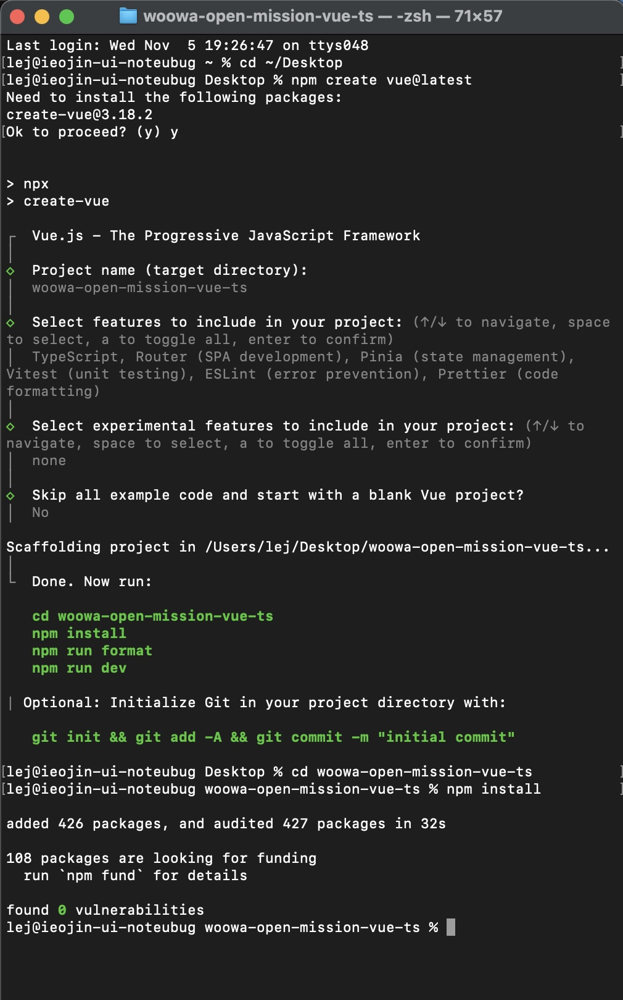
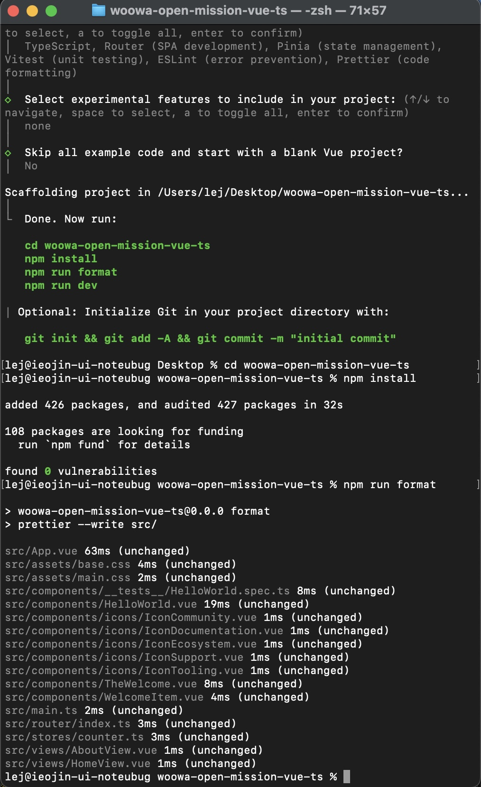

# 2025-11-05 (2일차)

## 프로젝트 환경 세팅

본격적으로 프로젝트를 시작했다. Desktop으로 이동해서 `npm create vue@latest` 명령어로 Vue 3 프로젝트를 생성했다. 프로젝트 이름은 어제 결정했던 대로 woowa-open-mission-vue-ts로 지었다.

설치 과정에서 여러 기능을 선택해야 했다. TypeScript, Router, Pinia, Vitest, ESLint, Prettier를 선택했고, JSX Support와 End-to-End Testing은 제외했다. JSX는 React 문법이라 Vue에서는 필요 없고, E2E 테스트는 지금 단계에서는 너무 복잡할 것 같았다. 실험적 기능인 Oxlint와 rolldown-vite도 안정성을 고려해 제외했다.

예제 코드를 포함할지 물어봤을 때는 No를 선택했다. 예제가 있으면 Vue 파일 구조를 참고하기 좋을 것 같아서다. 실제로 생성된 프로젝트를 보니 components, views, stores 폴더가 예제와 함께 구성되어 있었다.

`npm install`로 426개의 패키지를 설치하는 데 30초 정도 걸렸다. 그 다음 `npm run format`으로 코드 포맷을 정리했고, `npm run dev`로 개발 서버를 실행했다. Vite가 802ms 만에 서버를 띄웠고, localhost:5173에 "You did it!" 페이지가 떴다. 생각보다 정말 빠르다.

## 프로젝트 구조 파악

VS Code로 프로젝트 폴더를 열어서 구조를 살펴봤다. src 폴더 안에 components, views, stores, router 폴더가 있고, App.vue가 메인 컴포넌트인 것 같았다. node_modules는 설치된 라이브러리들이 들어있는데 뭔지 몰라서 찾아봤는데 일단 건드릴 필요는 없다고 한다.

## Git 저장소 연결

GitHub에 woowa-open-mission-vue-ts 레포지토리를 만들었다. Description은 "우아한테크코스 프리코스 오픈미션"으로 작성했다.

로컬에서 `git init`으로 Git을 초기화하고, `git add .`로 모든 파일을 스테이징했다. 첫 커밋 메시지는 "init: 프로젝트 초기 설정"으로 작성했다. 커밋 컨벤션은 `<type>: <subject>` 형식을 따르기로 했다.
