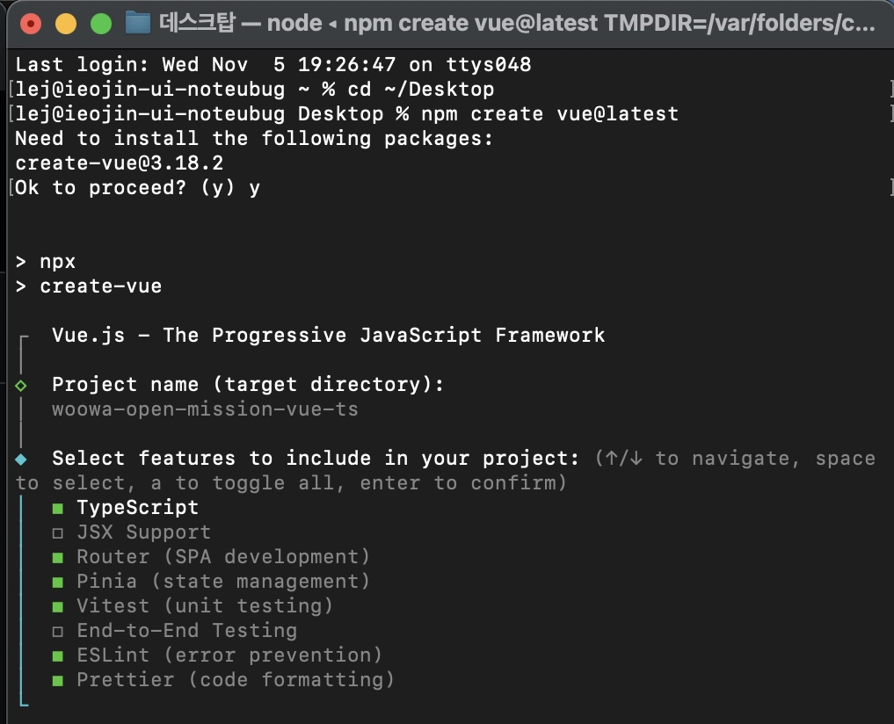

# 2025-11-05 (2일차)

## 프로젝트 환경 세팅

본격적으로 프로젝트를 시작했다. Desktop으로 이동해서 `npm create vue@latest` 명령어로 Vue 3 프로젝트를 생성했다. 프로젝트 이름은 어제 결정했던 대로 woowa-open-mission-vue-ts로 지었다.

설치 과정에서 여러 기능을 선택해야 했다.
TypeScript, Router, Pinia, Vitest, ESLint, Prettier를 선택했고, JSX Support와 End-to-End Testing은 제외했다. JSX는 React 문법이라 Vue에서는 필요 없고, E2E 테스트는 지금 단계에서는 너무 복잡할 것 같았다. 실험적 기능인 Oxlint와 rolldown-vite도 안정성을 고려해 제외했다.

예제 코드를 포함할지 물어봤을 때는 No를 선택했다. 예제가 있으면 Vue 파일 구조를 참고하기 좋을 것 같아서다. 실제로 생성된 프로젝트를 보니 components, views, stores 폴더가 예제와 함께 구성되어 있었다.

`npm install`로 426개의 패키지를 설치하는 데 30초 정도 걸렸다. 그 다음 `npm run format`으로 코드 포맷을 정리했고, `npm run dev`로 개발 서버를 실행했다. Vite가 정말 빠르게 서버를 띄웠고, localhost:5173로 들어가보니까 "You did it!" 페이지가 나왔다. 생각보다 정말 빠르다.

## 프로젝트 구조 파악

VS Code로 프로젝트 폴더를 열어서 구조를 살펴봤다. src 폴더 안에 components, views, stores, router 폴더가 있고, App.vue가 메인 컴포넌트인 것 같았다. node_modules는 설치된 라이브러리들이 들어있는데 뭔지 몰라서 찾아봤는데 일단 건드릴 필요는 없다고 한다.

## Git 저장소 연결

GitHub에 woowa-open-mission-vue-ts 레포지토리를 만들고 로컬 프로젝트와 연결했다. 커밋 컨벤션은 기존 우테코와 유사하게 `<type>: <subject>` 형식을 따르기로 했다.

## 개발 로그 구조 설계

학습 과정을 기록하기 위해 devlog 폴더를 만들고 날짜별로 파일을 관리하기로 했다. 처음에는 하나의 DEVLOG.md 파일로 통합할까 생각했지만, 날짜별로 파일을 분리하는 게 나중에 찾아보기 편할 것 같아서 20251104.md, 20251105.md 방식으로 관리하기로 했다.

## README 작성

프로젝트 소개를 위해 README.md를 작성했다.

도메인 개념을 명확한 클래스로 분리하고, TypeScript의 타입 시스템으로 객체 간 협력 관계를 정의하겠다는 목표를 메인으로 소개하기로 잡았다. 우테코에서 강조하는 객체지향 원칙을 이번 프로젝트에서도 실천해보고 싶었다.

기술 스택 섹션은 나중에 더 구체적으로 수정했다.
Vue는 Composition API로 로직을 함수 단위로 재사용할 수 있고, 반응형 시스템이 재고 관리 같은 실시간 업데이트에 적합하다는 점을 적었다. TypeScript는 내게 새로운 도전이라는 점을 가장 먼저 강조했다. JavaScript만 사용해봤고 우테코로 처음 코딩을 배운 입장에서, 타입 시스템을 학습하는 것 자체가 큰 의미가 있다고 생각했다.

막상 시작해서 주요 기능 섹션을 작성하려고 하는데, 원본 미션 레포지토리의 README가 비어있었다. 요구사항을 파악할 방법이 없어서 고민하다가 Fork된 레포지토리들을 확인해보기로 했다.

https://github.com/woowacourse-precourse/javascript-convenience-store-7/forks 에서 여러 사람들이 포크한 레포를 둘러봤다. 여러 레포에서 상세한 요구사항을 작성한 README를 발견했다. 이분들이 정리한 내용을 종합해서 편의점 미션의 핵심 요구사항을 파악할 수 있었다.

상품 관리, 프로모션 시스템, 구매 및 결제, 영수증 출력, 재고 관리, 추가 기능으로 나눠서 Features 섹션을 작성했다. 특히 프로모션 시스템은 N+1 무료 증정 방식, 프로모션 기간 자동 확인, 지능형 프로모션 안내 등 세부 내용을 구체적으로 적었다.

이 과정에서 편의점 미션이 생각보다 훨씬 복잡하다는 걸 알게 됐다. 프로모션 재고와 일반 재고를 따로 관리해야 하고, 프로모션 적용 가능 여부를 실시간으로 확인해야 하며, 부분 적용 케이스도 처리해야 한다. 2주 안에 이걸 Vue + TypeScript로 구현하려면 정말 빡빡할 것 같다는 생각이 들었다.

실행 예시 섹션에는 원본 Console 기반 미션의 입출력 예시를 넣었다. 단, "아래는 Console 기반 원본 미션의 실행 예시입니다. 본 프로젝트에서는 동일한 기능을 웹 UI로 구현합니다"라는 안내를 추가해서 우리 프로젝트와 차이를 명확히 했다.

## 웹 UI 재해석 전략 고민

원본 미션이 Console 기반이기 때문에, 이를 어떻게 웹 UI로 전환할지 구체적으로 고민했다.

### 파일 입출력 전환

원본은 `src/main/resources/*.md` 파일에서 상품과 프로모션 정보를 읽어온다. 웹에서는 `public/data/products.json`, `public/data/promotions.json` 형태로 변환해서 fetch API로 로드하기로 했다. 불러온 데이터는 Pinia store에 저장해서 전역에서 접근할 수 있게 한다. 중간에 바뀔지도 모르겠다.

### 상품 구매 입력 방식

원본은 `[콜라-10],[사이다-3]` 형식으로 텍스트 입력을 받는다. 웹에서는 두 가지 방법을 고민했다.

- 방법 1: 상품 카드마다 +/- 버튼으로 수량 선택
- 방법 2: 상품 검색 후 장바구니에 추가

일단 방법 1이 직관적이고 구현도 쉬울 것 같아서 이 방식으로 가기로 했다. 장바구니는 사이드바나 하단에 고정해서 실시간으로 담긴 상품을 확인할 수 있게 한다.

### Y/N 입력을 UI로

원본은 여러 상황에서 Y/N 입력을 받는다. 웹에서는 다음과 같이 전환하기로 했다.

**프로모션 추가 확인**: "콜라 1개를 무료로 더 받을 수 있습니다" 같은 안내를 모달창으로 띄운다. [추가하기] [괜찮아요] 버튼으로 선택받는다.

**정가 결제 확인**: "콜라 4개는 프로모션 할인이 적용되지 않습니다" 안내도 모달로 표시한다. [구매하기] [수량 조정] 버튼을 제공한다.

**멤버십 할인**: 결제 화면에 체크박스나 토글 스위치를 배치한다. "☑️ 멤버십 할인 적용 (최대 30%, 한도 8,000원)" 같은 설명과 함께 표시한다.

**추가 구매**: 영수증 화면 하단에 [추가 구매하기] [종료] 버튼을 배치한다.

### 출력 화면 구성

원본의 텍스트 출력을 다음과 같이 웹 UI로 전환하기로 했다.

**상품 목록**: 텍스트 리스트 대신 상품 카드를 그리드로 배치한다. 각 카드에는 상품명, 가격, 프로모션 태그, 재고 정보, [담기] 버튼이 들어간다.

**영수증**: ASCII 아트 대신 영수증 컴포넌트를 만든다. 실제 영수증처럼 보이도록 스타일링하되, 테이블 구조로 깔끔하게 정리한다.

**에러 메시지**: `[ERROR]` 텍스트 대신 화면 상단에 토스트 알림으로 표시한다. 빨간색 배경에 에러 메시지를 3초 정도 띄웠다가 자동으로 사라지게 한다.

### 페이지 구조 결정

처음에는 단일 페이지로 만들까 고민했지만, 상품 목록과 결제 화면을 분리하는 게 사용자 경험상 더 나을 것 같았다. Vue Router를 활용해서 다음과 같이 구성하기로 했다.

- `/`: 상품 목록 화면 (ProductList)
  - 상품 카드 그리드
  - 장바구니 사이드바
- `/checkout`: 결제 화면 (Checkout)
  - 장바구니 요약
  - 멤버십 체크박스
  - 프로모션/정가 확인 모달
  - 영수증

이렇게 구조를 나누면 컴포넌트 단위로 개발하기도 쉽고, 나중에 기능 추가할 때도 편할 것 같다.
