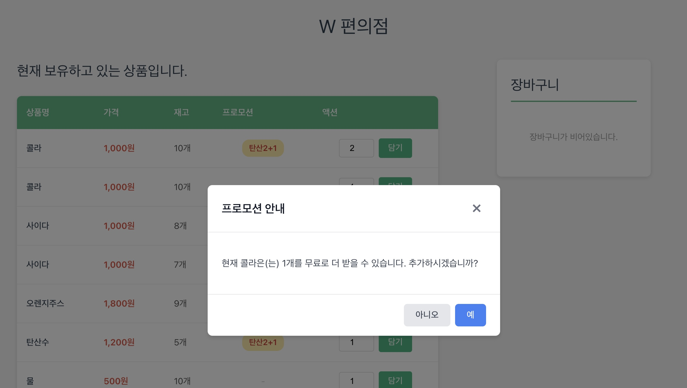
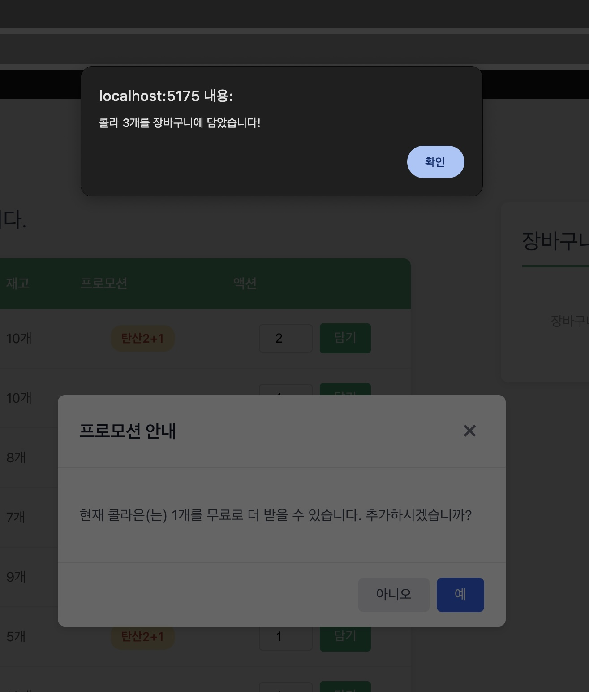

# 2025-11-11 (8일차)

## 프로모션 확인 모달 구현

어제 프로모션 판단 로직을 만들고 리팩토링까지 마쳤다. 오늘은 그 로직을 실제 UI와 연결해서 사용자에게 프로모션 안내를 보여주는 기능을 구현했다. 개인적으로 오늘이 지금까지 중에서 가장 머리가 아프고 복잡했던 느낌이다.

내가 이해한 원본 콘솔 미션에서는 두 가지 안내 메시지가 있었다. 첫 번째는 "현재 콜라는 1개를 무료로 더 받을 수 있습니다. 추가하시겠습니까?"라는 추가 증정 안내이다. 2+1 프로모션에서 2개를 담으려고 할 때 1개를 더 받을 수 있다면 이렇게 물어봐야한다. 두 번째는 "현재 콜라 4개는 프로모션 할인이 적용되지 않습니다. 그래도 구매하시겠습니까?"라는 정가 결제 확인이다. 프로모션 재고가 부족해서 일부는 정가로 결제해야 할 때 사용자에게 확인받는다.

웹 UI에서는 이걸 모달로 구현하기로 했다. 상품 담기 버튼을 누를 때 이런 상황이면 모달을 띄워서 사용자가 선택할 수 있게 한다.

## PromotionConfirmModal 컴포넌트 설계

먼저 모달 컴포넌트를 만들었다. BaseModal이 이미 있으니까 이걸 활용하기로 했다. BaseModal은 재사용 가능한 모달 기반 기능을 제공한다. 오버레이, ESC 키 닫기, 백드롭 클릭 닫기 같은 기본 기능이 구현되어 있다.

PromotionConfirmModal은 BaseModal을 감싸서 프로모션 관련 로직만 추가한다. Props로 type, productName, quantity를 받는다. type은 'additional-free'와 'full-price' 두 가지다. additional-free는 추가 증정 안내고, full-price는 정가 결제 확인이다.

getMessage 함수에서 type에 따라 메시지를 동적으로 생성한다. additional-free면 "무료로 더 받을 수 있습니다"라고 하고, full-price면 "프로모션 할인이 적용되지 않습니다"라고 한다. productName과 quantity를 템플릿 리터럴로 조합해서 자연스러운 문장을 만든다.

BaseModal의 closeOnBackdrop과 closeOnEsc를 false로 설정했다. 사용자가 반드시 예/아니오 중 하나를 선택하도록 강제한다. 모달 바깥을 클릭하거나 ESC를 눌러도 닫히지 않는다. 프로모션 확인은 중요한 결정이라서 명시적으로 선택하게 만들었다.

footer 슬롯에 버튼 두 개를 넣었다. 아니오 버튼은 회색, 예 버튼은 파란색이다. 예를 누르면 confirm 이벤트, 아니오를 누르면 cancel 이벤트를 emit한다.

## Cart에 프로모션 판단 메서드 추가

ProductTableRow에서 프로모션 판단 로직을 사용하려면 cartStore를 통해 접근할 수 있어야 한다. 그런데 프로모션 판단 로직은 PromotionPolicy에 있다. PromotionPolicy는 Cart의 private 필드라서 외부에서 직접 접근할 수 없다.

여기서 두 가지 선택지가 있었다. 첫 번째는 PromotionPolicy를 public으로 노출하는 것이다. cartStore에서 cart.promotionPolicy를 반환하면 컴포넌트가 직접 promotionPolicy.canGetAdditionalFreeItem을 호출할 수 있다. 두 번째는 Cart에 위임 메서드를 추가하는 것이다. Cart가 PromotionPolicy의 메서드를 호출해서 결과만 반환한다.

Cart에 위임 메서드를 추가하기로 결정했다. 이유는 캡슐화와 디미터 법칙 때문이다. 컴포넌트가 cart.promotionPolicy.canGetAdditionalFreeItem처럼 체인으로 접근하면 PromotionPolicy의 내부 구조까지 알아야 한다. cart.canGetAdditionalFreeItem처럼 하면 Cart만 알면 된다. 나중에 PromotionPolicy 인터페이스가 바뀌어도 Cart만 수정하면 되고 컴포넌트는 건드릴 필요가 없다.

Cart 클래스에 세 가지 메서드를 추가했다. canGetAdditionalFreeItem은 추가 증정 가능 여부를 boolean으로 반환한다. calculateFullPriceQuantity는 정가로 결제해야 하는 수량을 number로 반환한다. findApplicablePromotion은 현재 상품에 적용 가능한 프로모션을 반환한다. 세 메서드 모두 내부적으로 this.promotionPolicy의 메서드를 호출한다.

findApplicablePromotion을 추가한 이유는 추가 증정 개수를 알기 위해서다. 2+1 프로모션이면 1개를 더 받을 수 있고, 1+1 프로모션이면 1개를 더 받는다. promotion.get 값이 필요하다. 하지만 Product 객체에는 promotion 이름만 있고 Promotion 객체 자체는 없다. 그래서 현재 활성화된 Promotion 객체를 반환하는 메서드가 필요했다.

## cartStore에 메서드 노출

Cart에 추가한 세 메서드를 cartStore에서도 노출했다. cartStore는 Cart 인스턴스를 감싸는 래퍼다. 컴포넌트가 cartStore만 import하면 모든 기능에 접근할 수 있게 만든다.

canGetAdditionalFreeItem, calculateFullPriceQuantity, findApplicablePromotion 세 함수를 추가했다. 각 함수는 cart.value가 null인지 확인하고, null이 아니면 cart.value의 메서드를 호출한다. 그리고 return 객체에 세 함수를 추가해서 외부에 노출했다.

이제 컴포넌트에서 cartStore.canGetAdditionalFreeItem(product, quantity)처럼 호출할 수 있다. 컴포넌트는 Cart나 PromotionPolicy의 존재를 몰라도 된다. cartStore라는 단일 인터페이스를 통해 모든 기능에 접근한다.

## ProductTableRow에 프로모션 판단 로직 연결

ProductTableRow의 addToCart 함수를 수정했다. 기존에는 담기 버튼을 누르면 바로 cartStore.addItem을 호출했다. 이제는 프로모션 판단을 먼저 하고, 필요하면 모달을 띄운다.

먼저 모달 관련 상태를 추가했다. isModalOpen은 모달 표시 여부다. modalType은 'additional-free'와 'full-price' 중 하나다. modalQuantity는 모달에 표시할 수량이다. 추가 증정이면 몇 개를 더 받을 수 있는지, 정가 결제면 몇 개가 정가인지를 나타낸다. pendingQuantity는 사용자가 입력한 원래 수량이다. 모달 응답 처리 시 사용한다.

addToCart 함수의 흐름은 이렇다. 먼저 pendingQuantity에 현재 수량을 저장한다. isPromotionActive가 true일 때만 프로모션 판단을 한다. 프로모션이 없는 상품은 바로 장바구니에 담는다.

canGetAdditionalFreeItem을 호출해서 추가 증정이 가능한지 확인한다. 가능하면 findApplicablePromotion으로 Promotion 객체를 가져와서 promotion.get 값을 modalQuantity에 저장한다. modalType을 'additional-free'로 설정하고 isModalOpen을 true로 만든다. 그러면 PromotionConfirmModal이 렌더링된다. return으로 함수를 종료해서 장바구니 추가는 하지 않는다.

추가 증정이 불가능하면 calculateFullPriceQuantity를 호출한다. 0보다 크면 정가 결제 수량이 있다는 뜻이다. modalType을 'full-price'로 설정하고 modalQuantity에 정가 수량을 저장한다. isModalOpen을 true로 만들고 return으로 종료한다.

둘 다 해당 안 되면 모달 없이 바로 cartStore.addItem을 호출한다. 프로모션 재고가 충분해서 전부 프로모션 가격으로 담을 수 있는 경우다.

## 모달 응답 처리

handleModalConfirm은 사용자가 예를 눌렀을 때 호출된다. modalType에 따라 동작이 다르다. additional-free면 pendingQuantity에 modalQuantity를 더한다. 사용자가 2개를 담으려고 했고 1개를 더 받을 수 있다면, 최종적으로 3개를 담는다. full-price면 pendingQuantity를 그대로 사용한다. 정가 결제를 감수하고 원래 수량대로 담는다.

finalQuantity를 계산한 다음 cartStore.addItem을 호출한다. 성공하면 alert로 알리고 quantity를 1로 초기화한다. isModalOpen을 false로 만들어서 모달을 닫는다.

handleModalCancel은 사용자가 아니오를 눌렀을 때 호출된다. additional-free면 추가 증정 없이 원래 수량만 담는다. pendingQuantity로 cartStore.addItem을 호출한다. full-price면 아무것도 담지 않는다. 정가 결제를 원하지 않는다는 뜻이니까 장바구니 추가를 취소한다. 두 경우 모두 isModalOpen을 false로 만들어서 모달을 닫는다.

## 객체지향 관점에서의 설계

이번 구현에서 객체지향 원칙을 지키려고 노력했다. 위에서 언급하였지만, 오늘이 지금까지 중에서 가장 복잡했던 느낌이다.

디미터 법칙을 따랐다. 컴포넌트가 cart.promotionPolicy.method()처럼 체인으로 접근하지 않고 cart.method()로 접근한다. 중간 객체인 PromotionPolicy를 노출하지 않는다.

컴포넌트가 "프로모션 정책 객체 줘"가 아니라 "이 상품 추가 증정 가능해?"라고 물어본다. 객체의 내부 구조가 아니라 행동을 요청한다.

단일 책임 원칙을 유지했다. PromotionConfirmModal은 모달 표시만 담당한다. 프로모션 판단 로직은 PromotionPolicy가 한다. 상품 담기 흐름 제어는 ProductTableRow가 한다. 각 컴포넌트와 클래스가 명확한 하나의 책임만 가진다.

캡슐화를 지켰다. PromotionPolicy는 private으로 숨기고 필요한 메서드만 public으로 노출했다. 내부 구현은 감추고 인터페이스만 공개한다.

## 아직 해결하지 못한 문제 -> 20251111-02-troubleshooting

구현을 마치고 브라우저에서 테스트했다. 담기 버튼을 누르면 프로모션 판단이 작동한다. 모달도 정상적으로 표시된다. 하지만 장바구니 UI가 업데이트되지 않는 문제가 있다.

cartStore에서 shallowRef를 사용하고 있다. shallowRef는 객체 자체가 교체될 때만 변경을 감지한다. Cart 클래스 내부의 Map이 변경되어도 cart.value 자체는 같은 객체라서 변경이 감지되지 않는다.

devlog 20251109-01.md를 보면 shallowRef를 선택한 이유가 나와 있다. 도메인 클래스 인스턴스를 반응형으로 만들 때 깊은 반응성은 필요하지 않다고 판단했다. 클래스 인스턴스 자체만 교체되면 된다고 생각했다. 하지만 실제로는 클래스 내부의 Map이 변경될 때도 반응성이 필요하다.

해결 방법은 triggerRef를 사용하는 것이다. addItem, removeItem, updateQuantity 후에 triggerRef(cart)를 호출하면 강제로 변경을 트리거할 수 있다. 또는 shallowRef 대신 ref를 사용할 수도 있다. ref는 깊은 반응성을 제공해서 내부 Map 변경도 감지한다.

어느 쪽이 나을지는 다음에 고민해봐야겠다. triggerRef는 명시적이라서 언제 업데이트가 일어나는지 명확하다. 하지만 모든 메서드 호출 후에 triggerRef를 붙여야 해서 번거롭다. ref는 자동으로 감지하지만 성능 오버헤드가 있을 수 있다. 도메인 클래스의 모든 프로퍼티를 깊게 추적하는 게 과할 수 있다.
