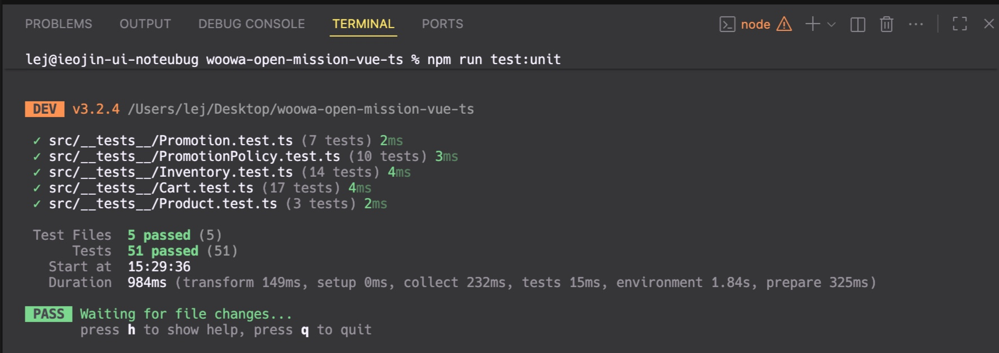

# 2025-11-15 - 나머지 도메인 테스트 작성

## 어제 작업 이어서

어제 Product, Promotion, Inventory 테스트를 작성했다. 오늘은 남은 도메인 클래스인 Cart와 PromotionPolicy 테스트를 작성하기로 했다.

시작하기 전에 어제 작성한 Inventory 테스트에서 타입 에러가 발생했다.

```
Argument of type 'Promotion | undefined' is not assignable to parameter of type 'Promotion | null'.
  Type 'undefined' is not assignable to type 'Promotion | null'.
```

`testPromotions[0]`이 `Promotion | undefined` 타입인데 `decreaseStock` 메서드는 `Promotion | null`을 받는다는 에러였다.

배열 인덱스 접근은 항상 undefined 가능성이 있기 때문에 TypeScript가 경고하는 것 같다. 아 테스트 환경에서는 promotion이 항상 존재한다는 걸 나는 알지만, 타입 시스템에서는 존재하는지 모른다.

## 타입 단언으로 해결하기

일단 TypeScript 문서에서 여러 방법을 검토했는데, 최종적으로는 두 가지 방법이 적합하다고 생각했다.

첫 번째는 Non-null assertion 연산자(`!`)를 사용하는 것이다.

```typescript
const promotion = testPromotions[0]!
```

이렇게 하면 "이 값이 null이나 undefined가 아니라고 확신한다"고 컴파일러에게 알려준다.

두 번째는 타입 단언(Type Assertion)을 사용하는 것이다.

```typescript
const promotion = testPromotions[0] as Promotion
```

이렇게 하면 눈치상 "이 값의 타입이 Promotion이다"라는 느낌을 명시적으로 선언하는 것 같다.

타입 단언을 선택했다. Non-null assertion보다 의도가 더 명확하다고 생각했다. `!`는 눈에 잘 안 띄고, 코드를 읽는 사람이 무슨 타입인지 추론해야 한다. 반면 `as Promotion`은 타입이 무엇인지 바로 보인다.

물론 둘 다 런타임 검사를 하지 않는다. 타입 단언은 컴파일러에게만 영향을 준다. 실제로 `testPromotions[0]`이 undefined라면 런타임 에러가 난다. 하지만 테스트 환경에서는 beforeEach가 항상 배열을 채우기 때문에 안전하다.

## Cart 테스트 작성

Cart 클래스를 먼저 확인했다. 의존성이 많았다. Product, Promotion, Inventory, CartItem, PromotionPolicy를 사용한다. 테스트 설정이 복잡할 것 같았다.

beforeEach에서 필요한 모든 의존성을 준비했다.

```typescript
beforeEach(() => {
  testPromotions = [new Promotion(PROMOTION_NAME, 2, 1, PROMOTION_START_DATE, PROMOTION_END_DATE)]

  const products = [
    new Product(PRODUCT_NAME, PRODUCT_PRICE, PROMOTION_STOCK, PROMOTION_NAME),
    new Product(PRODUCT_NAME, PRODUCT_PRICE, NORMAL_STOCK, null),
    new Product(OTHER_PRODUCT_NAME, OTHER_PRODUCT_PRICE, OTHER_PRODUCT_STOCK, null),
  ]
  testInventory = new Inventory(products)

  testProduct = new Product(PRODUCT_NAME, PRODUCT_PRICE, PROMOTION_STOCK, PROMOTION_NAME)
  testOtherProduct = new Product(OTHER_PRODUCT_NAME, OTHER_PRODUCT_PRICE, OTHER_PRODUCT_STOCK, null)

  testCart = new Cart(testPromotions, testInventory)
})
```

Promotion 배열을 만들고, 프로모션 상품과 일반 상품을 섞어서 Inventory를 구성했다. 실제 사용 환경과 비슷하게 만들려고 했다.

테스트할 메서드를 정리했다. addItem, removeItem, updateQuantity 같은 CRUD 메서드, getTotalPrice, getPromotionDiscount, getFreeItems 같은 계산 메서드, getMembershipDiscount, getFinalPrice 같은 할인 메서드. 총 17개 테스트를 작성했다.

## (간단한) 재고 부족 에러

테스트를 실행했더니 3개가 실패했다. 멤버십 할인 관련 테스트였다.

```
Error: [ERROR] 재고가 부족합니다. 상품: 사이다, 요청 수량: 10
```

사이다 재고를 5개로 설정했는데 테스트에서 10개, 30개를 요청했다. 멤버십 할인 계산을 테스트하려고 큰 금액이 필요해서 수량을 많이 넣었는데, 재고를 생각 안 하고 작성한 거였다.

`OTHER_PRODUCT_STOCK`을 50으로 늘렸다. 30개를 요청해도 충분한 재고다. 테스트가 전부 통과했다.

이 과정에서 Cart의 addItem이 재고 검증을 먼저 한다는 걸 다시 확인했다. 도메인 로직이 올바르게 작동한다는 증거라고 생각한다.

## PromotionPolicy 테스트 작성

PromotionPolicy는 Cart에서 사용하는 프로모션 로직을 담당한다. findApplicablePromotion, canGetAdditionalFreeItem, calculateFullPriceQuantity 세 가지 메서드가 있다.

Cart 테스트와 비슷하게 Promotion, Inventory를 beforeEach에서 준비했다.

```typescript
beforeEach(() => {
  testPromotions = [new Promotion(PROMOTION_NAME, 2, 1, PROMOTION_START_DATE, PROMOTION_END_DATE)]

  const products = [
    new Product(PRODUCT_NAME, PRODUCT_PRICE, PROMOTION_STOCK, PROMOTION_NAME),
    new Product(PRODUCT_NAME, PRODUCT_PRICE, NORMAL_STOCK, null),
  ]
  testInventory = new Inventory(products)

  testProduct = new Product(PRODUCT_NAME, PRODUCT_PRICE, PROMOTION_STOCK, PROMOTION_NAME)
  testProductWithoutPromotion = new Product(PRODUCT_NAME, PRODUCT_PRICE, NORMAL_STOCK, null)

  testPromotionPolicy = new PromotionPolicy(testPromotions, testInventory)
})
```

프로모션이 있는 상품과 없는 상품을 각각 만들었다. 두 경우를 모두 테스트해야 했기 때문이다.

10개 테스트를 작성했다. findApplicablePromotion은 활성/비활성 프로모션, 프로모션 없는 상품 케이스를 확인했다. canGetAdditionalFreeItem은 세트 완성 여부, 재고 부족 여부를 검증했다.

## 전체 테스트 확인

모든 도메인 클래스 테스트 작성이 끝났다. 전체 테스트를 실행했다.



51개 테스트가 모두 통과했다! (Product 3개, Promotion 7개, PromotionPolicy 10개, Inventory 14개, Cart 17개)

## 테스트 작성하면서 느낀 점

Cart와 PromotionPolicy는 의존성이 많아서 테스트 설정이 복잡했다. beforeEach가 길어졌다. 하지만 실제 사용 환경과 비슷하게 만들려고 노력했다. 프로모션 상품과 일반 상품을 섞어서 Inventory를 구성하고, 다양한 케이스를 검증했다.

재고 검증 로직이 테스트 중에 작동하는 걸 보면서, 도메인 로직이 제대로 동작한다는 확신이 들었다. 테스트를 통과하려면 비즈니스 규칙을 정확히 이해해야 한다. 테스트를 작성하면서 프로모션 계산 방식, 재고 차감 우선순위 같은 걸 다시 정리할 수 있었다.

생성자 테스트 없음, beforeEach로 불변 객체 생성, AAA 패턴, 타입 단언 사용같은 어제 작성한 테스트 패턴을 그대로 따랐다.

---

오늘 Cart와 PromotionPolicy 테스트를 작성하면서 도메인 클래스 테스트가 완성됐다. 총 51개 테스트가 모든 핵심 비즈니스 로직을 검증한다.

의존성이 많은 클래스는 테스트 설정이 복잡하지만, beforeEach로 공통 설정을 분리하면 각 테스트는 간결하게 유지된다. 실제 사용 환경과 비슷한 테스트 데이터를 만드는 게 중요하다.

테스트를 작성하면서 비즈니스 로직을 다시 한번 이해하게 된 것 같다. 프로모션 계산, 재고 검증, 멤버십 할인 같은 복잡한 규칙들이 테스트로 문서화됐다.

이틀에 걸쳐 도메인 레이어의 모든 클래스에 테스트를 추가했다. 이제 리팩토링할 때 나름 테스트가 안전망 역할을 해줄 것이라 생각한다.
