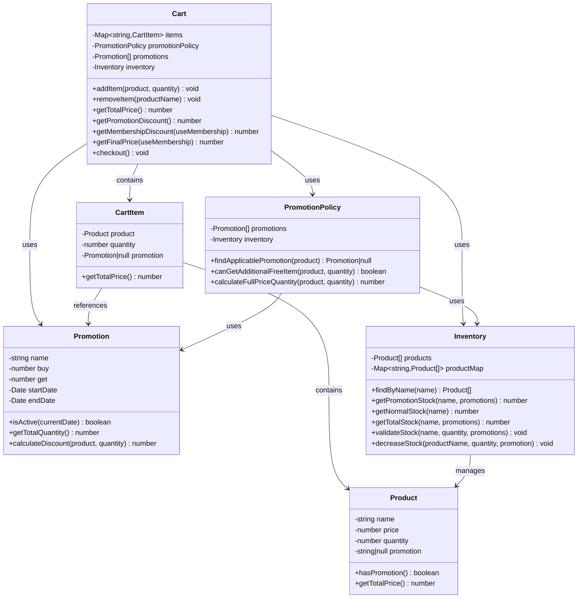
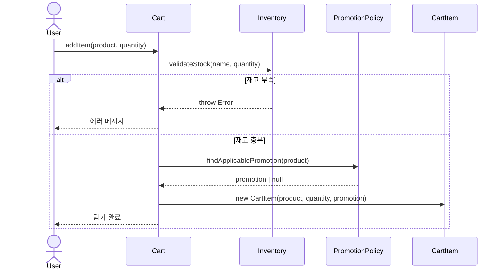
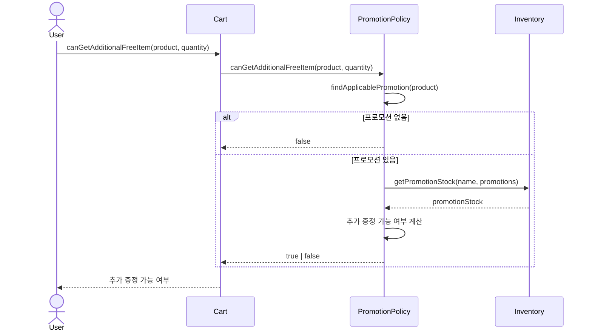
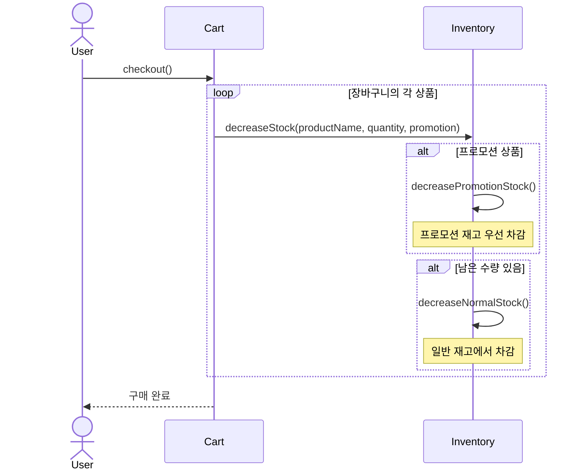

# 도메인 구조

Mermaid로 만든 편의점 POS 시스템의 핵심 비즈니스 로직을 담당하는 도메인 계층이다.

## 클래스 다이어그램

## 주요 흐름도

### 1. 상품 담기 플로우

### 2. 프로모션 확인 플로우

### 3. 결제 및 재고 차감 플로우

## 클래스별 책임

### Product

상품의 기본 정보를 관리한다. 상품명, 가격, 재고 수량, 프로모션 여부를 포함한다.

### Promotion

프로모션 정책을 정의한다. N+1 형식(예: 2+1, 1+1)의 무료 증정 방식과 유효 기간을 관리한다.

### CartItem

장바구니에 담긴 개별 상품을 표현한다. 상품 정보, 구매 수량, 적용된 프로모션을 포함한다.

### Cart

장바구니의 핵심 로직을 담당한다. 상품 추가/삭제, 가격 계산, 할인 계산, 결제 처리를 수행한다.

### PromotionPolicy

프로모션 적용 규칙을 관리한다. 상품에 적용 가능한 프로모션을 찾고, 추가 증정 가능 여부와 정가 결제 수량을 계산한다.

### Inventory

재고 관리를 담당한다. 프로모션 재고와 일반 재고를 구분하여 관리하고, 재고 검증 및 차감을 처리한다.

## 도메인 처리 로직 상세

### 상품을 장바구니에 담는 과정

사용자가 상품을 장바구니에 담으려고 할 때 가장 먼저 일어나는 일은 재고 검증이다. Cart의 addItem 메서드가 호출되면 Inventory의 validateStock을 즉시 호출한다. 재고가 부족하면 여기서 바로 에러를 던진다. 이 순서가 중요한 이유는 사용자에게 빠른 피드백을 주기 위해서다. 프로모션 계산 같은 복잡한 로직을 수행하기 전에 재고 부족을 먼저 확인하면 불필요한 연산을 막을 수 있다.

재고 검증을 통과하면 다음은 프로모션 확인이다. PromotionPolicy의 findApplicablePromotion이 호출된다. 이 메서드는 상품에 promotion 속성이 있는지 먼저 확인한다. 프로모션 속성이 없으면 바로 null을 반환한다. 프로모션 속성이 있으면 promotions 배열에서 해당 이름의 프로모션을 찾는다. 찾았다고 끝이 아니다. isActive 메서드로 현재 날짜 기준 유효한지 확인한다. 기간이 지났으면 프로모션이 있어도 적용되지 않는다.

적용 가능한 프로모션을 찾았으면 CartItem을 생성한다. CartItem은 상품, 수량, 프로모션 세 가지를 받는다. 프로모션이 null일 수도 있고 Promotion 객체일 수도 있다. CartItem은 이 정보를 저장만 하고, 실제 할인 계산은 나중에 한다. CartItem의 getTotalPrice는 상품 가격에 수량을 곱한 값을 반환한다. 프로모션 할인은 여기서 계산하지 않는다.

생성된 CartItem은 Cart의 items Map에 저장된다. 상품명을 키로 사용한다. 같은 상품을 다시 담으면 기존 CartItem을 덮어쓴다. 이렇게 하면 같은 상품이 중복으로 들어가지 않는다.

### 프로모션 추가 증정 확인

2+1 프로모션이 있는 상품을 2개만 담으면 1개를 무료로 더 받을 수 있다. 이걸 확인하는 게 canGetAdditionalFreeItem이다. 이 메서드는 여러 조건을 확인한다.

먼저 프로모션이 있어야 한다. findApplicablePromotion을 호출해서 확인한다. 프로모션이 없으면 바로 false다.

프로모션이 있으면 프로모션 재고를 확인한다. Inventory의 getPromotionStock을 호출한다. 프로모션 재고가 부족하면 추가 증정이 불가능하다.

현재 담으려는 수량이 프로모션 세트에서 buy 수량과 딱 맞아떨어지는지 계산한다. 2+1 프로모션에서 buy는 2고 get은 1이다. 세트 전체 수량은 3이다. 사용자가 2개 담았으면 2를 3으로 나눈 나머지가 2다. 이게 buy와 같으면 조건을 만족한다. 5개 담았으면 나머지가 2라서 역시 조건을 만족한다. 하지만 3개나 4개를 담았으면 나머지가 0이나 1이라서 조건에 맞지 않는다.

마지막으로 프로모션 재고가 현재 수량에 get을 더한 값 이상이어야 한다. 2개 담았고 1개 더 받으려면 프로모션 재고가 3개 이상 있어야 한다. 이 모든 조건을 만족하면 true를 반환한다.

### 정가 결제 수량 계산

프로모션 재고가 한정되어 있을 때 일부는 프로모션 가격이고 일부는 정가다. calculateFullPriceQuantity가 이걸 계산한다.

예를 들어 2+1 프로모션에서 프로모션 재고가 6개라고 하자. 세트 수량은 3이니까 6을 3으로 나누면 2세트를 만들 수 있다. 프로모션으로 살 수 있는 최대 수량은 6개다.

사용자가 10개를 담으려고 하면 6개는 프로모션 가격이고 4개는 정가다. 10에서 6을 빼면 4다. 이게 정가 결제 수량이다.

사용자가 5개만 담으면 모두 프로모션 가격이다. 5는 6보다 작으니까 정가 결제 수량은 0이다. Math.max로 음수가 나오는 걸 방지한다.

이 정보는 사용자에게 알림을 보여줄 때 사용된다. 정가 결제 수량이 0보다 크면 일부는 정가라고 알려준다.

### 할인 계산

Cart의 getPromotionDiscount는 프로모션 할인액을 계산한다. items Map의 모든 CartItem을 순회한다. 각 CartItem에 promotion이 있으면 Promotion의 calculateDiscount를 호출한다.

calculateDiscount는 수량을 세트 수량으로 나눈 몫을 구한다. 2+1 프로모션에서 9개를 샀으면 9를 3으로 나눠서 3세트다. 세트당 get개를 무료로 받으니까 3세트면 3개가 무료다. 3개에 상품 가격을 곱하면 할인액이다.

멤버십 할인은 getMembershipDiscount에서 계산한다. useMembership이 false면 0을 반환한다. true면 프로모션 미적용 금액을 먼저 구한다. 총 구매액에서 프로모션 할인액을 뺀 값이다. 여기에 0.3을 곱한다. 30% 할인이다. 하지만 최대 8000원까지만 할인된다. Math.min으로 상한선을 적용한다.

최종 가격은 getFinalPrice에서 계산한다. 총 구매액에서 프로모션 할인을 빼고 멤버십 할인을 또 뺀다. 순서가 중요하다. 프로모션 할인을 먼저 적용해야 멤버십 할인 대상 금액이 정확히 계산된다.

### 재고 차감

결제가 완료되면 checkout 메서드가 호출된다. 장바구니의 모든 상품을 순회하면서 Inventory의 decreaseStock을 호출한다.

decreaseStock은 프로모션 재고를 먼저 차감한다. 프로모션이 null이 아니면 decreasePromotionStock을 호출한다. 이 메서드는 프로모션 상품을 products 배열에서 찾는다. 상품명과 프로모션명이 모두 일치해야 한다.

찾았으면 차감 가능한 만큼 차감한다. 프로모션 재고가 3개인데 5개를 차감하려면 3개만 차감하고 2를 반환한다. 차감한 만큼 새로운 Product 인스턴스를 만들어서 배열에 교체한다. Product가 불변이라서 직접 수정할 수 없다. updateProductQuantity가 이 역할을 한다.

남은 수량이 있으면 decreaseNormalStock을 호출한다. 일반 재고 상품을 찾아서 같은 방식으로 차감한다. 프로모션 재고 우선 차감이 중요한 이유는 프로모션 기간이 한정되어 있기 때문이다. 프로모션 재고를 먼저 소진하고 일반 재고는 나중에 팔아도 된다.

재고 차감이 끝나면 productMap을 다시 만든다. groupByName을 호출해서 상품명별로 재분류한다. 이렇게 하면 다음 조회 때 최신 재고 정보를 가져올 수 있다.

### 객체 간 협력

Cart는 혼자서 모든 걸 하지 않는다. Inventory에게 재고 검증을 맡기고 PromotionPolicy에게 프로모션 찾기를 맡긴다. Cart는 이들을 조합해서 장바구니 기능을 제공한다. Cart는 생성자에서 Inventory와 PromotionPolicy를 받는다. 구체적인 구현을 알 필요 없이 메서드만 호출하면 된다.

PromotionPolicy도 Inventory를 의존한다. 추가 증정 가능 여부를 판단할 때 재고 정보가 필요하다. getPromotionStock을 호출해서 프로모션 재고를 조회한다. PromotionPolicy는 재고를 직접 관리하지 않고 Inventory에게 물어본다.

각 클래스가 자기 역할에만 집중한다. Product는 상품 정보만 관리한다. Promotion은 프로모션 규칙만 정의한다. CartItem은 자기 총 가격만 계산한다. Inventory는 재고만 관리한다. PromotionPolicy는 프로모션 적용 규칙만 판단한다. Cart는 이들을 조율해서 장바구니 기능을 완성한다.
